# Portal Siswa — SMA NEGERI 1 MEDAN

[](https://www.typescriptlang.org/)
[](https://react.dev/)
[](https://vite.dev/)
[](https://tailwindcss.com/)
[](https://pages.github.com/)

Aplikasi web portal sekolah berbasis React, Vite, dan Tailwind CSS untuk manajemen operasional guru, siswa, orang tua, dan admin. Menyediakan alur kerja terpisah untuk setiap peran dengan tampilan korporat modern.

---

## Daftar Isi

- [Fitur Utama](#fitur-utama)
- [Role & Alur Kerja](#role--alur-kerja)
- [Teknologi](#teknologi)
- [Arsitektur](#arsitektur)
- [Mulai Cepat](#mulai-cepat)
- [Perintah Penting](#perintah-penting)
- [Environment Variables](#environment-variables)
- [Testing](#testing)
- [Deployment](#deployment)
- [Struktur Proyek](#struktur-proyek)
- [Kontribusi](#kontribusi)
- [Lisensi](#lisensi)

---

## Fitur Utama

### Guru

- **Dashboard** — statistik presensi kelas, grafik kehadiran, aksi cepat
- **Absensi Harian** — catat kehadiran siswa per kelas per tanggal
- **Laporan** — rekap absensi per kelas + ekspor PDF/CSV
- **Roster Kelas** — atur jadwal pelajaran
- **Pengumuman Kelas** — kirim pengumuman ke kelas tertentu
- **Tugas Online** — buat tugas, kumpulkan jawaban siswa
- **Kotak Surat** — validasi surat izin/sakit siswa
- **Input Rapot** — input nilai + ekspor PDF/CSV
- **Profil** — foto, kontak, pengaturan akun

### Siswa

- **Dashboard** — ringkasan kehadiran, jadwal hari ini, pengumuman
- **Riwayat Absensi** — kalender kehadiran + ekspor
- **Roster Kelas** — jadwal mingguan
- **Kantong Tugas** — lihat & kumpulkan tugas
- **Kirim Surat** — surat izin/sakit dengan lampiran file
- **Rapot** — lihat nilai + ekspor PDF/CSV
- **Tagihan Sekolah** — riwayat tagihan + unduh rekap PDF tahunan
- **Profil** — foto, data diri

### Orang Tua

- **Dashboard** — pantau presensi & nilai anak
- **Rapot** — lihat nilai anak
- **Tagihan** — status pembayaran

### Admin

- **Dashboard** — KPI sistem overview
- **Akun Siswa** — CRUD, mutasi kelas, pagination + search
- **Akun Guru** — CRUD, filter
- **Akun Orang Tua** — manajemen
- **Kelas** — atur kelas & wali kelas
- **Roster** — atur jadwal mengajar
- **Tagihan Sekolah** — atur monthly fee, terapkan ke semua siswa
- **Pengumuman Admin** — kirim ke semua/kelas tertentu

### Tamu

- **Dashboard Publik** — informasi sekolah, PPDB, galeri
- **PPDB** — landing page + form pendaftaran online
- **Buku Tamu Digital** — isi pesan, rating, statistik
- **Profil Sekolah** — visi misi, struktur organisasi, fasilitas

### Fitur Lintas-Role

- **Notifikasi Real-time** — badge counter di sidebar untuk pesan, surat, pengumuman
- **File Upload** — drag & drop, validasi tipe/ukuran, preview
- **Ekspor Data** — PDF (jsPDF) + CSV (Excel-compatible UTF-8 BOM)
- **Pencarian & Pagination** — search bar + pagination di semua data table
- **Grafik & Chart** — SVG-based donut chart & bar chart (tanpa library tambahan)
- **Perpustakaan Digital** — katalog buku, peminjaman, pengembalian
- **Animasi Halaman** — transisi halus antar halaman

---

## Role & Alur Kerja

| Role | Akses Utama | URL Prefix |
|------|-------------|------------|
| **Guru** | Dashboard, Absensi, Laporan, Tugas, Rapot, Surat | `/guru/*` |
| **Siswa** | Dashboard, Roster, Rapot, Tagihan, Surat, Tugas | `/siswa/*` |
| **Orang Tua** | Dashboard, Rapot, Tagihan | `/ortu/*` |
| **Admin** | Dashboard, Kelola Akun, Kelas, Tagihan, Pengumuman | `/admin/*` |
| **Tamu** | Beranda Publik, PPDB, Buku Tamu, Profil Sekolah | `/tamu/*` |

Setiap role memiliki sidebar navigasi sendiri. Route guard otomatis — halaman yang tidak sesuai role akan di-reset ke halaman default.

---

## Teknologi

### Frontend

| Teknologi | Versi | Fungsi |
|-----------|-------|--------|
| React | 19 | UI framework |
| TypeScript | 5.9 | Type safety |
| Vite | 7 | Bundler & dev server |
| Tailwind CSS | 4 | Utility-first CSS |
| Zustand | 5 | State management |
| React Router | 7 | Routing (partial) |
| Lucide React | — | Icons |
| jsPDF | 4 | PDF export |
| Tailwind Merge | 3 | Class merging |

### Testing

| Alat | Fungsi |
|------|--------|
| Vitest | Unit & integration tests |
| Playwright | E2E browser tests |
| Testing Library | React component tests |

### Backend (Starter)

| Teknologi | Fungsi |
|-----------|--------|
| Express | REST API server |
| Prisma | ORM + schema migration |
| PostgreSQL | Database (planned) |

> **Catatan Versi:** Wiki/dokumen lama menyebut React 18 dan `src/data/store.ts` monolit. Kondisi repo terkini: **React 19.2.3**, store sudah dipecah ke `src/data/store/core.ts` + `zustandStores.ts` + `index.ts` (barrel), service layer di `src/data/services/` (16 domain services).

---

## Arsitektur

### Layer Architecture

```
┌─────────────────────────────────────────────────┐
│  Components (UI)                                │
│  src/components/ui/ — Button, Card, Table, dll  │
├─────────────────────────────────────────────────┤
│  Features (Fitur)                               │
│  src/fitur/{role}/ — Halaman per role           │
├─────────────────────────────────────────────────┤
│  Service Layer                                  │
│  src/data/services/ — 16 domain services        │
├─────────────────────────────────────────────────┤
│  Store Layer                                    │
│  src/data/store/ — core + Zustand wrappers      │
├─────────────────────────────────────────────────┤
│  localStorage (Browser Storage)                 │
└─────────────────────────────────────────────────┘
```

### Service Layer (16 Domain Services)

| Service | Fungsi |
|---------|--------|
| `coreService` | Inisialisasi data, hash password, storage GC |
| `teacherService` | CRUD guru |
| `studentService` | CRUD siswa, mutasi kelas |
| `classService` | CRUD kelas |
| `attendanceService` | Absensi per kelas/tanggal/siswa |
| `announcementService` | Pengumuman sekolah |
| `libraryService` | Buku, anggota, transaksi perpustakaan |
| `ppdbService` | 22 fungsi pendaftaran siswa baru |
| `classActivityService` | Roster, tugas, pengumuman kelas |
| `messageService` | Pesan antar role |
| `taskService` | Tugas, tagihan, nilai, jadwal |
| `suratIzinService` | Surat izin/sakit CRUD |
| `billingService` | Tagihan sekolah, pembayaran |
| `rapotService` | Nilai rapot CRUD |
| `pengumumanAdminService` | Pengumuman admin |
| `lessonService` | RPS & catatan mengajar |

### Zustand Reactive Stores (9 Stores)

- `useTeacherStore`, `useStudentStore`, `useAttendanceStore`
- `usePPDBStore`, `useLibraryStore`, `useAnnouncementStore`
- `useBillingStore`, `useRapotStore`, `useMessageStore`

---

## Mulai Cepat

### Prasyarat

- **Node.js** 20+ (LTS direkomendasikan)
- **npm** 10+

### Instalasi

```bash
# Clone repository
git clone https://github.com/username/projeck-portal-siswa.git
cd projeck-portal-siswa

# Install dependencies
npm install

# Salin environment variables
cp env.example .env
# Edit .env sesuai kebutuhan (lihat tabel di bawah)

# Jalankan development server
npm run dev
```

Akses di `http://localhost:5173`.

### Login Demo

Setelah menjalankan dev server, gunakan kredensial berikut:

| Role | ID | Password |
|------|----|----------|
| **Guru** | `198501012010011001` | `guru123` |
| **Siswa** | `2024001` | `siswa123` |
| **Orang Tua** | `Siti Aminah` | `ortu123` |
| **Admin** | (via env var) | (via env var) |
| **Tamu** | `Tamu Pengunjung` | `TAMU2026` |

---

## Perintah Penting

| Perintah | Fungsi |
|----------|--------|
| `npm run dev` | Jalankan development server (Vite) |
| `npm run build` | Build produksi (typecheck dulu) |
| `npm run preview` | Preview hasil build |
| `npm run typecheck` | Cek error tipe TypeScript (`tsc --noEmit`) |
| `npm run lint` | Cek linting (ESLint) |
| `npm run lint:fix` | Perbaiki linting otomatis |
| `npm run format` | Format kode dengan Prettier |
| `npm test` | Jalankan unit tests (Vitest) |
| `npm run test:watch` | Test mode watch |
| `npm run test:coverage` | Test dengan coverage report |
| `npm run test:e2e` | Jalankan E2E tests (Playwright) |

---

## Environment Variables

Buat file `.env` di root proyek:

| Variable | Wajib | Default | Deskripsi |
|----------|-------|---------|-----------|
| `VITE_ADMIN_USERNAME` | ✅ | — | Username login admin |
| `VITE_ADMIN_PASSWORD` | ✅ | — | Password login admin |
| `VITE_GOOGLE_CLIENT_ID` | ❌ | (default demo) | Google OAuth Client ID |
| `VITE_SUPPORT_EMAIL` | ❌ | — | Email untuk tombol "Laporkan Bug" |
| `VITE_API_BASE_URL` | ❌ | `http://localhost:4000/api` | Backend API URL |

> **⚠️ PENTING:** `VITE_ADMIN_USERNAME` dan `VITE_ADMIN_PASSWORD` **wajib di-set**. Tidak ada fallback ke `admin/admin` untuk alasan keamanan.

---

## Testing

### Unit Tests (Vitest)

```bash
npm test
```

127+ tests di 12 test files:
- `store.test.ts` — CRUD data siswa, guru, kelas, dll.
- `cn.test.ts` — utility class merging
- `logger.test.ts` — logging wrapper
- `export.test.ts` — CSV/PDF export
- `gambar.test.ts` — image compression
- `ppdbFlow.test.ts` — PPDB integration flow
- `authApi.test.ts` — API auth
- `ppdbService.test.ts` — PPDB service
- `ErrorBoundary.test.tsx` — React error boundary
- `agenda.test.ts` — agenda akademik
- `utils.test.ts` — utility functions

### E2E Tests (Playwright)

```bash
npm run test:e2e
```

5 spec files: login flow (5 role), navigation (sidebar guru/siswa), admin panel (dashboard, data, kelas), PPDB flow.

---

## Deployment

### GitHub Pages (Otomatis via CI/CD)

Setiap push ke branch `main` akan otomatis:
1. Checkout repo
2. Install dependencies (`npm ci`)
3. Build (`npm run build`)
4. Deploy ke GitHub Pages

Konfigurasi ada di `.github/workflows/deploy.yml`.

### Hosting Lain

Hasil build ada di folder `dist/`. Upload ke:
- **Vercel** — `vercel --prod`
- **Netlify** — deploy `dist/`
- **Cloudflare Pages** — deploy `dist/`
- **Hosting statis** — upload folder `dist/`

> **Catatan:** Data saat ini disimpan di **localStorage** browser. Data tidak sinkron antar perangkat. Untuk skala sekolah penuh, perlu backend dan database terpusat (sudah ada starter di `backend/`).

---

## Struktur Proyek

```
projeck-portal-siswa/
├── .github/workflows/      # CI/CD (deploy.yml)
├── backend/                # Express + Prisma starter
│   ├── prisma/             # Schema & migrations
│   └── src/                # Routes, middleware, config
├── e2e/                    # Playwright E2E tests
├── src/
│   ├── components/
│   │   ├── common/         # ErrorBoundary
│   │   └── ui/             # Design System (Button, Card, Table, dll)
│   ├── context/            # AuthContext
│   ├── data/
│   │   ├── services/       # 16 domain service files
│   │   └── store/          # core store + Zustand wrappers
│   ├── fitur/
│   │   ├── admin/          # Panel admin + components
│   │   ├── autentikasi/    # Login page, Google login
│   │   ├── bersama/        # Shared components (notif, pengumuman)
│   │   ├── guru/           # 12 halaman guru
│   │   ├── halaman/        # School website pages
│   │   ├── murid/          # 8 halaman siswa
│   │   ├── orang-tua/      # 2 halaman orang tua
│   │   ├── penerimaan-siswa-baru/  # PPDB pages
│   │   ├── pengaturan/     # Account settings
│   │   ├── perpustakaan/   # Library system
│   │   └── tamu/           # Guest/public pages
│   ├── hooks/              # Custom hooks
│   ├── layout/             # AppShell, Sidebar, Footer
│   ├── services/           # API config & auth API
│   ├── utils/              # cn, export, gambar, logger
│   ├── App.tsx             # Main app (state-based routing)
│   ├── main.tsx            # Entry point
│   ├── routes.ts           # Route definitions & helpers
│   └── types.ts            # TypeScript type definitions
├── vitest.config.ts        # Vitest configuration
├── playwright.config.ts    # Playwright configuration
├── vite.config.ts          # Vite configuration
└── package.json
```

---

# BAGIAN 1 — Project Overview
Sertakan diagram "User Entry and Routing Flow" dan "Data Entity Relationship":

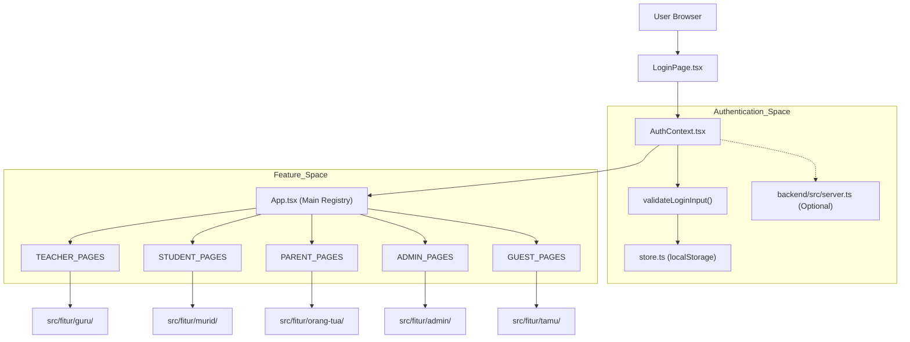
```mermaid
graph TD
    User["User Browser"] --> Login["LoginPage.tsx"]
    Login --> AuthContext["AuthContext.tsx"]

    subgraph Authentication_Space
        AuthContext --> Validate["validateLoginInput()"]
        Validate --> Store["store.ts (localStorage)"]
        AuthContext -.-> Backend["backend/src/server.ts (Optional)"]
    end

    AuthContext --> App["App.tsx (Main Registry)"]

    subgraph Feature_Space
        App --> Teacher["TEACHER_PAGES"]
        App --> Student["STUDENT_PAGES"]
        App --> Parent["PARENT_PAGES"]
        App --> Admin["ADMIN_PAGES"]
        App --> Guest["GUEST_PAGES"]
    end

    Teacher --> GuruDir["src/fitur/guru/"]
    Student --> MuridDir["src/fitur/murid/"]
    Parent --> OrtuDir["src/fitur/orang-tua/"]
    Admin --> AdminDir["src/fitur/admin/"]
    Guest --> TamuDir["src/fitur/tamu/"]
```

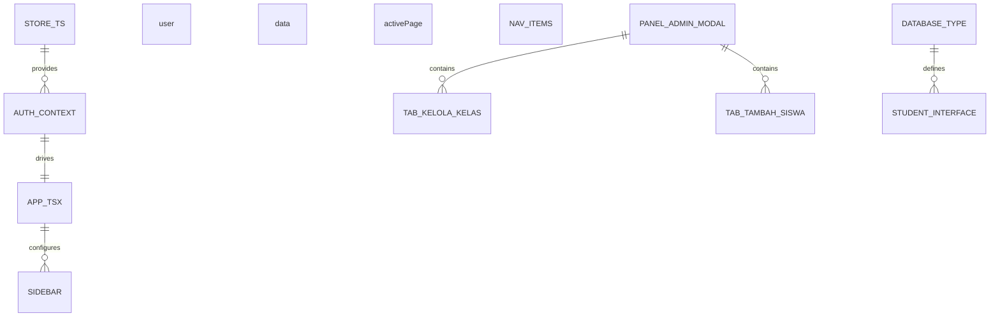
```mermaid
erDiagram
    STORE_TS ||--o{ AUTH_CONTEXT : provides user data
    AUTH_CONTEXT ||--|| APP_TSX : drives activePage
    APP_TSX ||--o{ SIDEBAR : configures NAV_ITEMS
    PANEL_ADMIN_MODAL ||--o{ TAB_KELOLA_KELAS : contains
    PANEL_ADMIN_MODAL ||--o{ TAB_TAMBAH_SISWA : contains
    DATABASE_TYPE ||--o{ STUDENT_INTERFACE : defines
```

# BAGIAN 1.1 — Getting Started & Project Setup
Sertakan diagram "Backend Architecture" dan "Data Flow & Initialization":

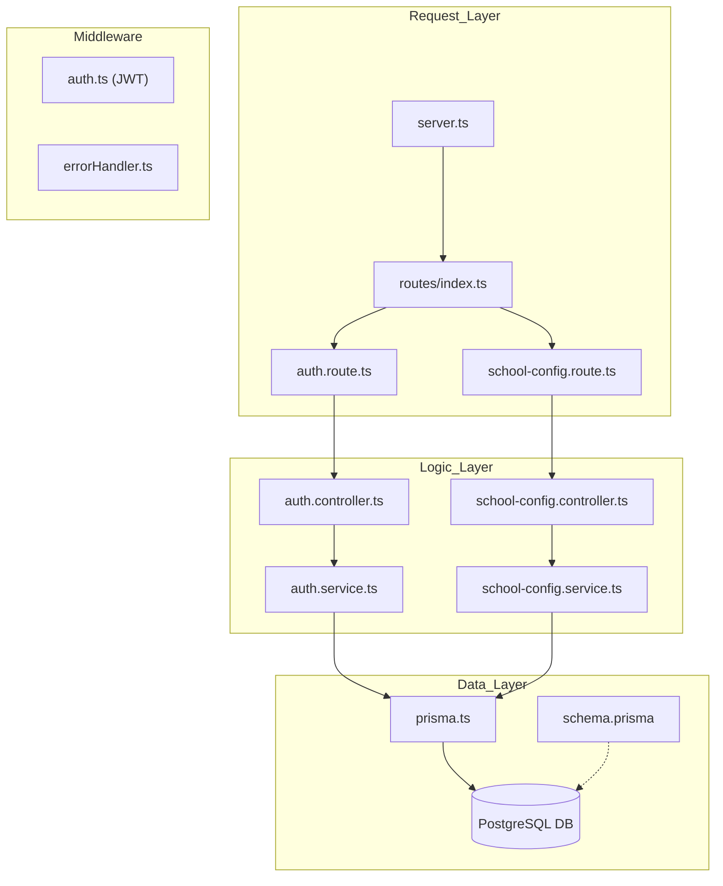
```mermaid
graph TD
    subgraph Request_Layer
        A["server.ts"] --> B["routes/index.ts"]
        B --> C["auth.route.ts"]
        B --> D["school-config.route.ts"]
    end

    subgraph Logic_Layer
        C --> E["auth.controller.ts"]
        E --> F["auth.service.ts"]
        D --> G["school-config.controller.ts"]
        G --> H["school-config.service.ts"]
    end

    subgraph Data_Layer
        F --> I["prisma.ts"]
        H --> I
        I --> J[("PostgreSQL DB")]
        K["schema.prisma"] -.-> J
    end

    subgraph Middleware
        L["auth.ts (JWT)"]
        M["errorHandler.ts"]
    end
```

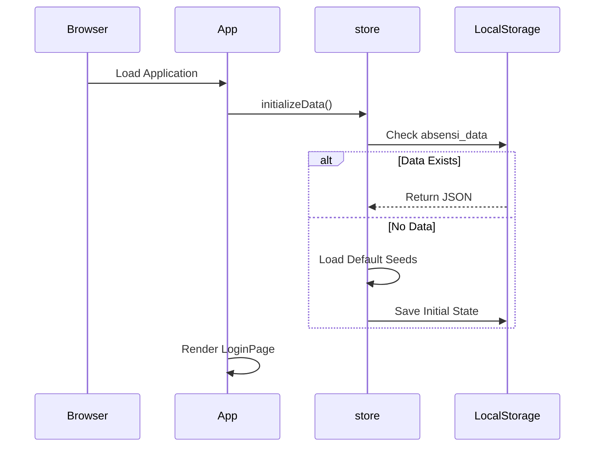
```mermaid
sequenceDiagram
    participant User as Browser
    participant App as App
    participant Store as store
    participant LS as LocalStorage

    User->>App: Load Application
    App->>Store: initializeData()
    Store->>LS: Check absensi_data
    alt Data Exists
        LS-->>Store: Return JSON
    else No Data
        Store->>Store: Load Default Seeds
        Store->>LS: Save Initial State
    end
    App->>App: Render LoginPage
```

# BAGIAN 1.2 — Application Architecture
Sertakan diagram "Role-to-Registry Mapping" dan "Data Flow and Persistence":

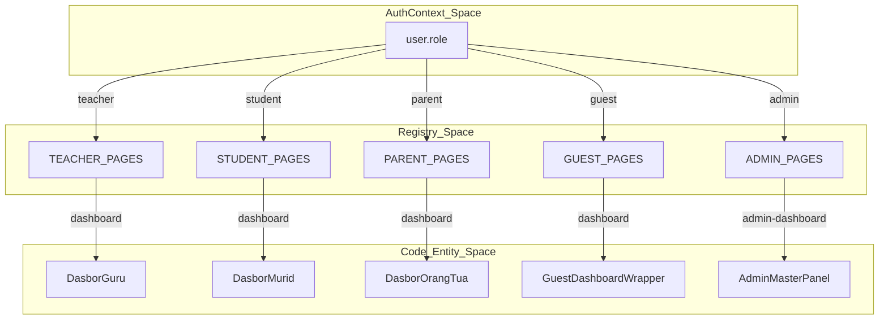
```mermaid
graph TD
    subgraph AuthContext_Space
        UserRole["user.role"]
    end

    subgraph Registry_Space
        TEACHER["TEACHER_PAGES"]
        STUDENT["STUDENT_PAGES"]
        PARENT["PARENT_PAGES"]
        GUEST["GUEST_PAGES"]
        ADMIN["ADMIN_PAGES"]
    end

    subgraph Code_Entity_Space
        DG["DasborGuru"]
        DM["DasborMurid"]
        DOT["DasborOrangTua"]
        GDW["GuestDashboardWrapper"]
        AMP["AdminMasterPanel"]
    end

    UserRole -- teacher --> TEACHER
    UserRole -- student --> STUDENT
    UserRole -- parent --> PARENT
    UserRole -- guest --> GUEST
    UserRole -- admin --> ADMIN

    TEACHER -- dashboard --> DG
    STUDENT -- dashboard --> DM
    PARENT -- dashboard --> DOT
    GUEST -- dashboard --> GDW
    ADMIN -- admin-dashboard --> AMP
```

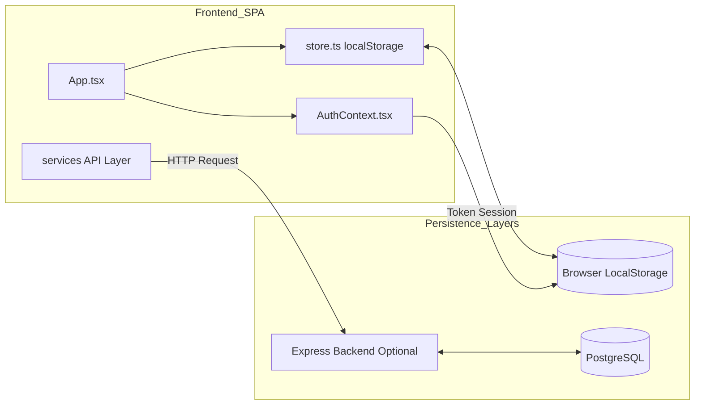
```mermaid
graph LR
    subgraph Frontend_SPA
        App["App.tsx"]
        Store["store.ts localStorage"]
        Auth["AuthContext.tsx"]
        API["services API Layer"]
    end

    subgraph Persistence_Layers
        LS[("Browser LocalStorage")]
        BE["Express Backend Optional"]
        DB[("PostgreSQL")]
    end

    App --> Store
    Store <--> LS
    App --> Auth
    Auth -- Token Session --> LS
    API -- HTTP Request --> BE
    BE <--> DB
```

# BAGIAN 2 — Authentication & User Roles
Sertakan diagram "Authentication Logic Diagram" dan "Role-to-Entity Mapping":

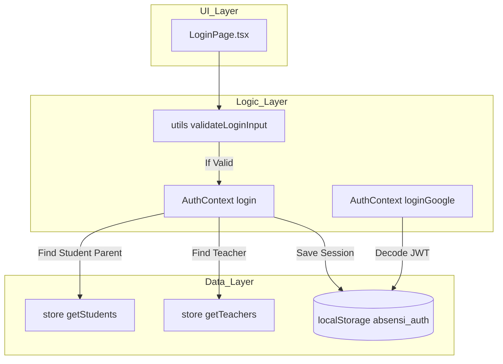
```mermaid
graph TD
    subgraph UI_Layer
        LP["LoginPage.tsx"]
    end

    subgraph Logic_Layer
        AC["AuthContext login"]
        GG["AuthContext loginGoogle"]
        VAL["utils validateLoginInput"]
    end

    subgraph Data_Layer
        ST["store getStudents"]
        TC["store getTeachers"]
        LS[("localStorage absensi_auth")]
    end

    LP --> VAL
    VAL -- If Valid --> AC
    AC -- Find Teacher --> TC
    AC -- Find Student Parent --> ST
    AC -- Save Session --> LS
    GG -- Decode JWT --> LS
```

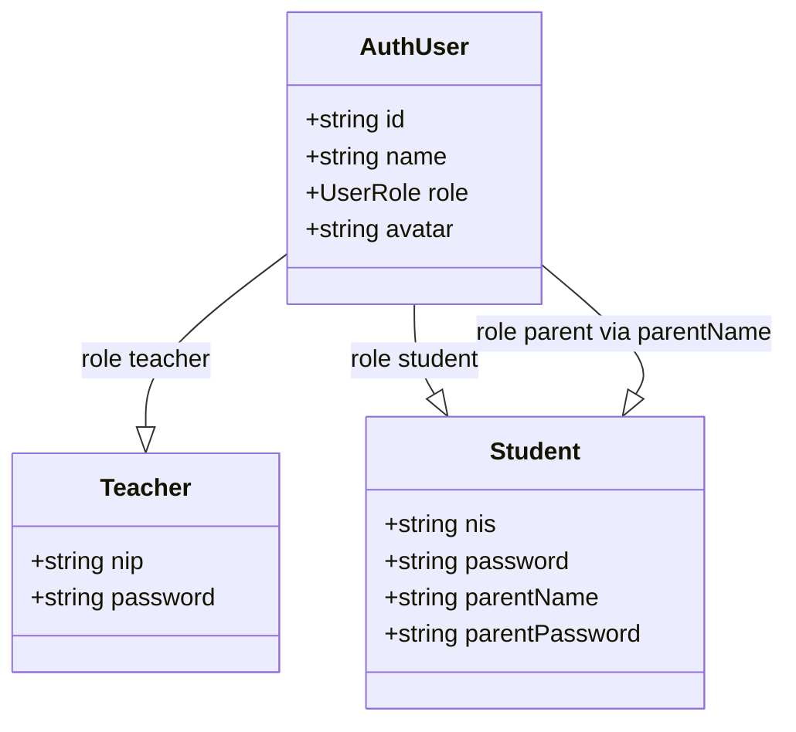
```mermaid
classDiagram
    class AuthUser {
        +string id
        +string name
        +UserRole role
        +string avatar
    }

    class Teacher {
        +string nip
        +string password
    }

    class Student {
        +string nis
        +string password
        +string parentName
        +string parentPassword
    }

    AuthUser --|> Teacher : role teacher
    AuthUser --|> Student : role student
    AuthUser --|> Student : role parent via parentName
```

# BAGIAN 3 — Data Layer & State Management
Sertakan diagram "Entity to Code Mapping" dan "Data Flow & Synchronization":

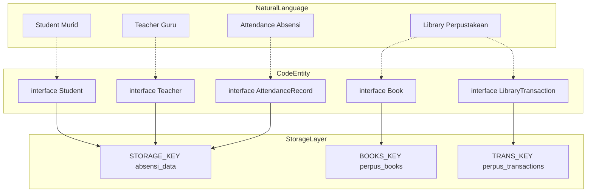
```mermaid
graph TD
    subgraph NaturalLanguage
        Student["Student Murid"]
        Teacher["Teacher Guru"]
        Attendance["Attendance Absensi"]
        Library["Library Perpustakaan"]
    end

    subgraph CodeEntity
        IStudent["interface Student"]
        ITeacher["interface Teacher"]
        IAttendance["interface AttendanceRecord"]
        IBook["interface Book"]
        ITransaction["interface LibraryTransaction"]
    end

    subgraph StorageLayer
        S_KEY["STORAGE_KEY absensi_data"]
        B_KEY["BOOKS_KEY perpus_books"]
        T_KEY["TRANS_KEY perpus_transactions"]
    end

    Student -.-> IStudent
    Teacher -.-> ITeacher
    Attendance -.-> IAttendance
    Library -.-> IBook
    Library -.-> ITransaction

    IStudent --> S_KEY
    ITeacher --> S_KEY
    IAttendance --> S_KEY
    IBook --> B_KEY
    ITransaction --> T_KEY
```

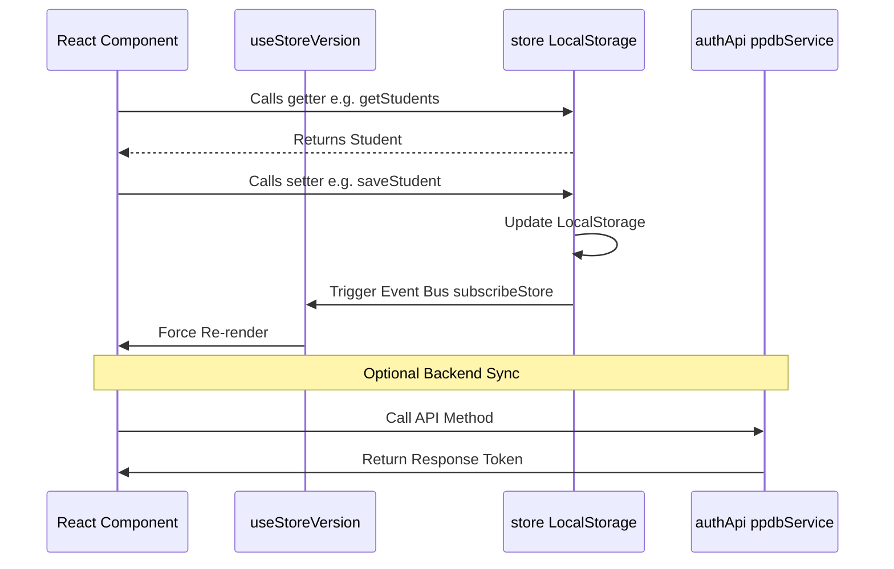
```mermaid
sequenceDiagram
    participant UI as React Component
    participant Hook as useStoreVersion
    participant Store as store LocalStorage
    participant API as authApi ppdbService

    UI->>Store: Calls getter e.g. getStudents
    Store-->>UI: Returns Student

    UI->>Store: Calls setter e.g. saveStudent
    Store->>Store: Update LocalStorage
    Store->>Hook: Trigger Event Bus subscribeStore
    Hook->>UI: Force Re-render

    Note over UI,API: Optional Backend Sync
    UI->>API: Call API Method
    API->>UI: Return Response Token
```

# BAGIAN 4 — Role-Based Feature Modules
Sertakan diagram "Page Registry" dan "Shared Domain Objects":

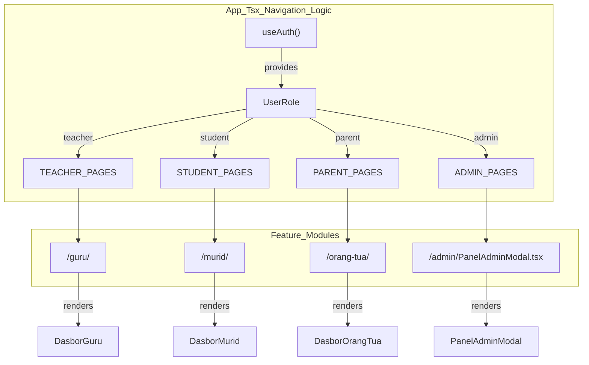
```mermaid
graph TD
    subgraph App_Tsx_Navigation_Logic
        Auth["useAuth()"] -- provides --> Role["UserRole"]
        Role -- teacher --> TP["TEACHER_PAGES"]
        Role -- student --> SP["STUDENT_PAGES"]
        Role -- parent --> PP["PARENT_PAGES"]
        Role -- admin --> AP["ADMIN_PAGES"]
    end

    subgraph Feature_Modules
        TP --> G["/guru/"]
        SP --> M["/murid/"]
        PP --> OT["/orang-tua/"]
        AP --> AD["/admin/PanelAdminModal.tsx"]
    end

    G -- renders --> DG["DasborGuru"]
    M -- renders --> DM["DasborMurid"]
    OT -- renders --> DOT["DasborOrangTua"]
    AD -- renders --> PAM["PanelAdminModal"]
```

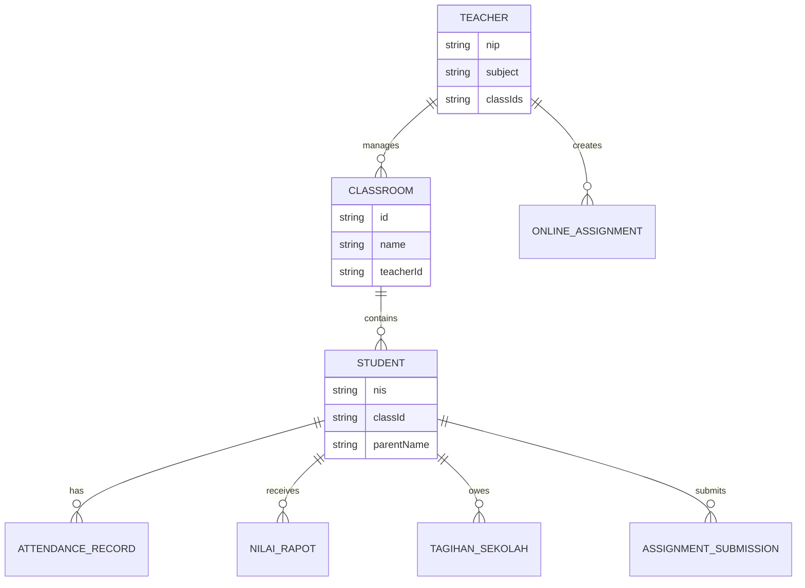
```mermaid
erDiagram
    TEACHER ||--o{ CLASSROOM : manages
    CLASSROOM ||--o{ STUDENT : contains
    STUDENT ||--o{ ATTENDANCE_RECORD : has
    STUDENT ||--o{ NILAI_RAPOT : receives
    STUDENT ||--o{ TAGIHAN_SEKOLAH : owes
    TEACHER ||--o{ ONLINE_ASSIGNMENT : creates
    STUDENT ||--o{ ASSIGNMENT_SUBMISSION : submits

    TEACHER {
        string nip
        string subject
        string classIds
    }
    STUDENT {
        string nis
        string classId
        string parentName
    }
    CLASSROOM {
        string id
        string name
        string teacherId
    }
```

# BAGIAN 5 — Library System (Perpustakaan)
Sertakan diagram "System Overview" dan "Data Entity Relationship":

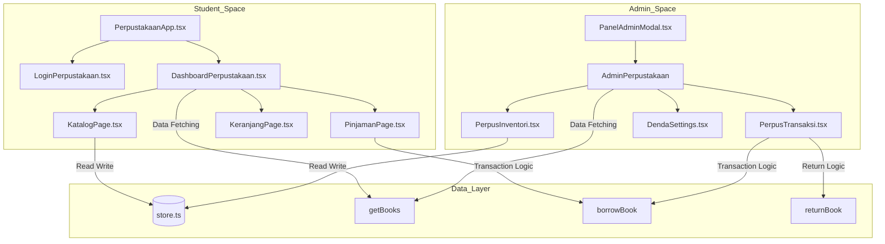
```mermaid
graph TD
    subgraph Student_Space
        A["PerpustakaanApp.tsx"] --> B["LoginPerpustakaan.tsx"]
        A --> C["DashboardPerpustakaan.tsx"]
        C --> D["KatalogPage.tsx"]
        C --> E["PinjamanPage.tsx"]
        C --> F["KeranjangPage.tsx"]
    end

    subgraph Admin_Space
        G["PanelAdminModal.tsx"] --> H["AdminPerpustakaan"]
        H --> I["PerpusInventori.tsx"]
        H --> J["PerpusTransaksi.tsx"]
        H --> K["DendaSettings.tsx"]
    end

    subgraph Data_Layer
        L[("store.ts")]
        M["getBooks"]
        N["borrowBook"]
        O["returnBook"]
    end

    D & I -- Read Write --> L
    E & J -- Transaction Logic --> N
    J -- Return Logic --> O
    C & H -- Data Fetching --> M
```

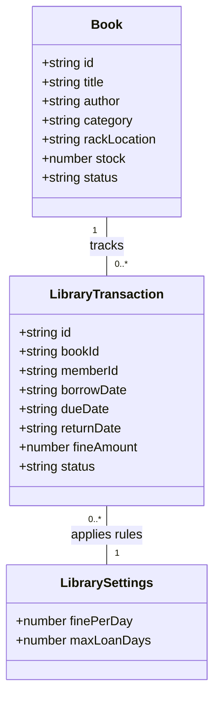
```mermaid
classDiagram
    class Book {
        +string id
        +string title
        +string author
        +string category
        +string rackLocation
        +number stock
        +string status
    }
    class LibraryTransaction {
        +string id
        +string bookId
        +string memberId
        +string borrowDate
        +string dueDate
        +string returnDate
        +number fineAmount
        +string status
    }
    class LibrarySettings {
        +number finePerDay
        +number maxLoanDays
    }

    Book "1" -- "0..*" LibraryTransaction : tracks
    LibraryTransaction "0..*" -- "1" LibrarySettings : applies rules
```

# BAGIAN 6 — New Student Admissions (PPDB)
Sertakan diagram "Component Relationship" dan "Application Lifecycle":

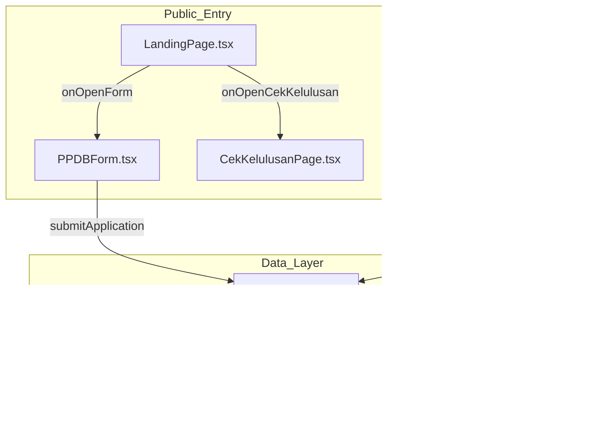
```mermaid
graph TD
    subgraph Public_Entry
        LandingPage["LandingPage.tsx"]
        PPDBForm["PPDBForm.tsx"]
        CekKelulusan["CekKelulusanPage.tsx"]
    end

    subgraph Administrative_Management
        AdminPanel["AdminPanel.tsx"]
    end

    subgraph Data_Layer
        PPDBService["ppdbService.ts"]
        Store["store.ts LocalStorage"]
    end

    LandingPage -->|onOpenForm| PPDBForm
    LandingPage -->|onOpenCekKelulusan| CekKelulusan
    PPDBForm -->|submitApplication| PPDBService
    AdminPanel -->|updateStatus| PPDBService
    PPDBService -->|CRUD Operations| Store
```

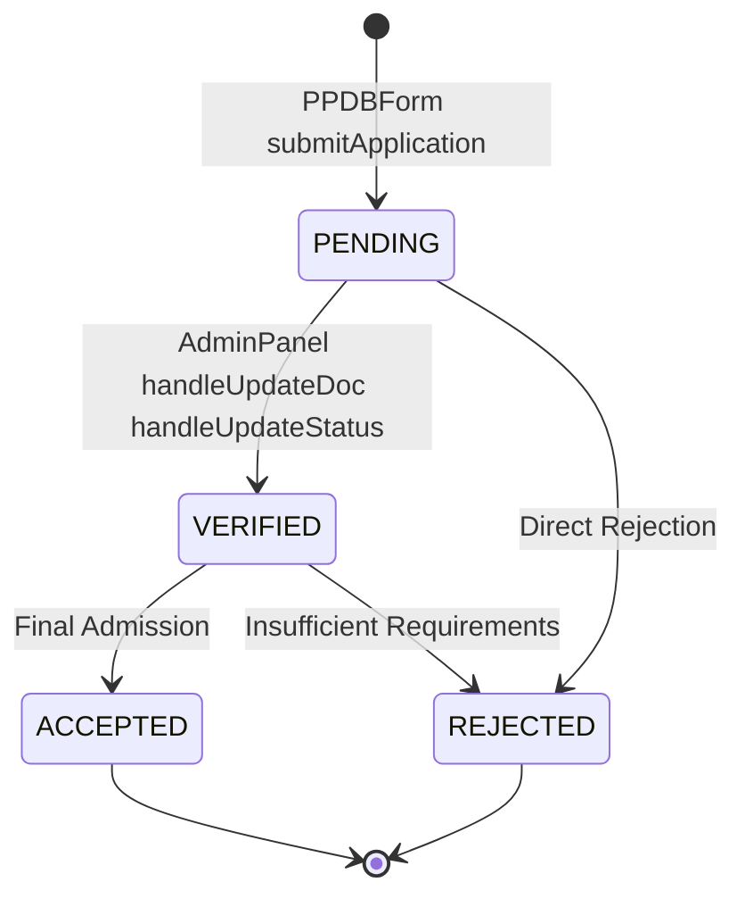
```mermaid
stateDiagram-v2
    [*] --> PENDING : PPDBForm submitApplication
    PENDING --> VERIFIED : AdminPanel handleUpdateDoc handleUpdateStatus
    VERIFIED --> ACCEPTED : Final Admission
    VERIFIED --> REJECTED : Insufficient Requirements
    PENDING --> REJECTED : Direct Rejection
    ACCEPTED --> [*]
    REJECTED --> [*]
```

# BAGIAN 7 — Guest (Tamu) Module
Sertakan diagram "Guest Module Entity Relationship" dan "Guest Navigation and Data Flow":

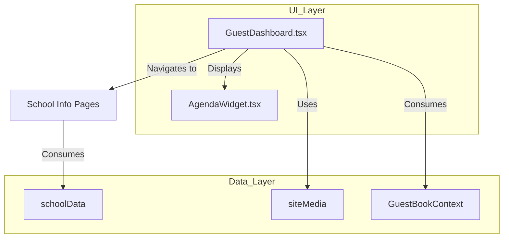
```mermaid
graph TD
    subgraph UI_Layer
        GD["GuestDashboard.tsx"]
        AW["AgendaWidget.tsx"]
    end

    subgraph Data_Layer
        SD["schoolData"]
        SM["siteMedia"]
        GBC["GuestBookContext"]
    end

    GD -->|Uses| SM
    GD -->|Displays| AW
    GD -->|Consumes| GBC
    GD -->|Navigates to| InfoPages["School Info Pages"]

    InfoPages -->|Consumes| SD
```

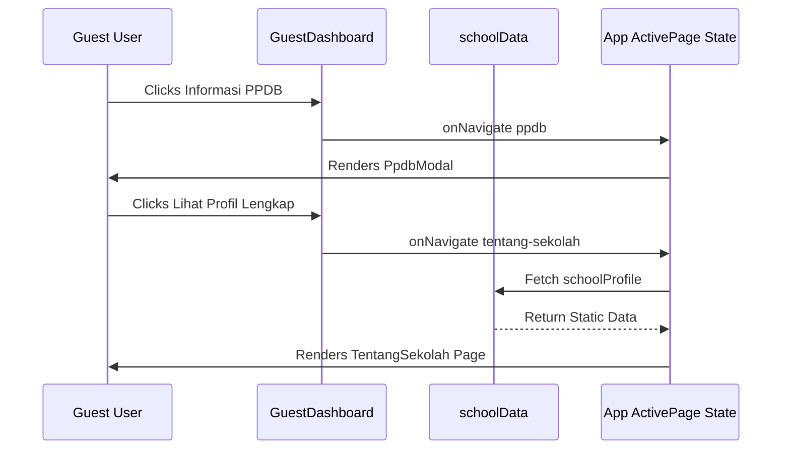
```mermaid
sequenceDiagram
    participant G as Guest User
    participant GD as GuestDashboard
    participant SD as schoolData
    participant APP as App ActivePage State

    G->>GD: Clicks Informasi PPDB
    GD->>APP: onNavigate ppdb
    APP->>G: Renders PpdbModal

    G->>GD: Clicks Lihat Profil Lengkap
    GD->>APP: onNavigate tentang-sekolah
    APP->>SD: Fetch schoolProfile
    SD-->>APP: Return Static Data
    APP->>G: Renders TentangSekolah Page
```

# BAGIAN 8 — Public School Website (Halaman)
Sertakan diagram "Code to UI Mapping" dan classDiagram ExpectationModal:

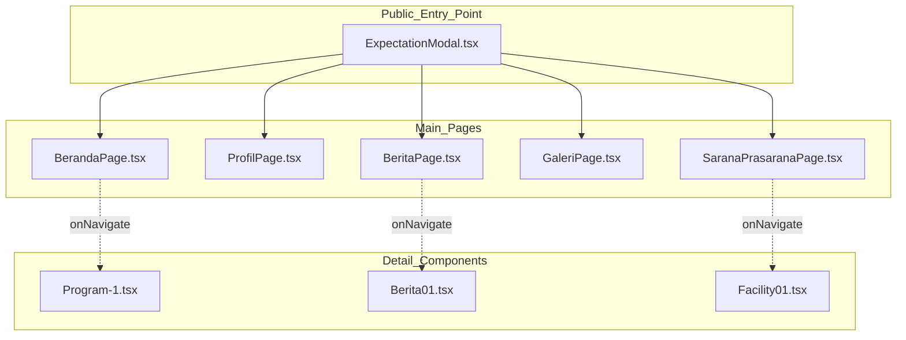
```mermaid
graph TD
    subgraph Public_Entry_Point
        EM["ExpectationModal.tsx"]
    end

    subgraph Main_Pages
        BP["BerandaPage.tsx"]
        PR["ProfilPage.tsx"]
        BR["BeritaPage.tsx"]
        GL["GaleriPage.tsx"]
        SP["SaranaPrasaranaPage.tsx"]
    end

    subgraph Detail_Components
        P1["Program-1.tsx"]
        B1["Berita01.tsx"]
        F1["Facility01.tsx"]
    end

    EM --> BP
    EM --> PR
    EM --> BR
    EM --> GL
    EM --> SP

    BP -.->|onNavigate| P1
    BR -.->|onNavigate| B1
    SP -.->|onNavigate| F1
```

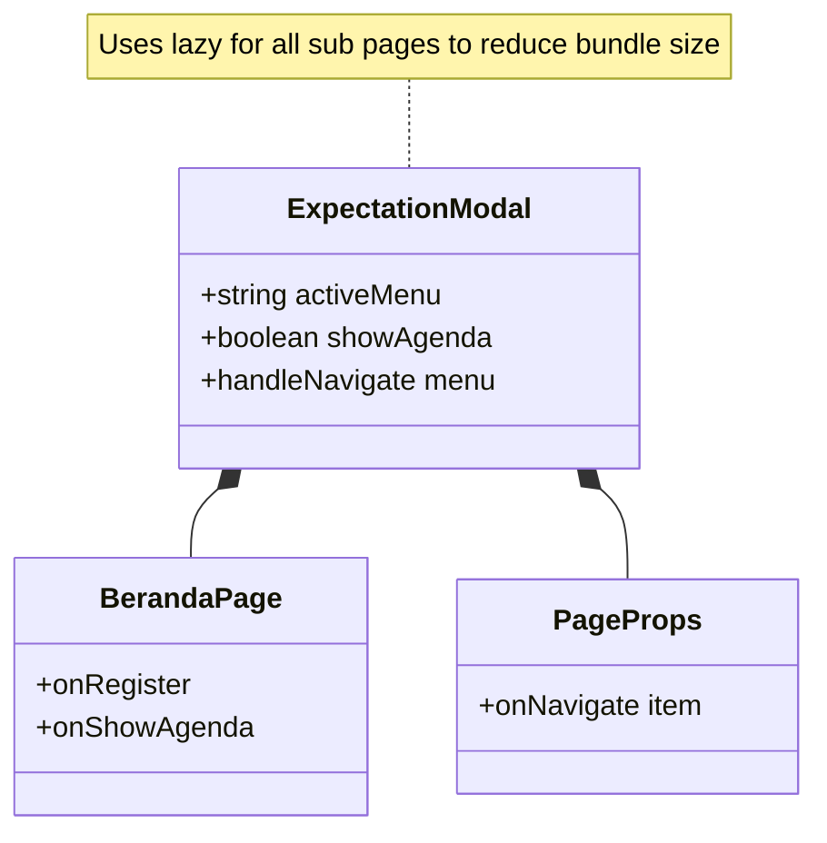
```mermaid
classDiagram
    class ExpectationModal {
        +string activeMenu
        +boolean showAgenda
        +handleNavigate menu
    }
    class BerandaPage {
        +onRegister
        +onShowAgenda
    }
    class PageProps {
        +onNavigate item
    }

    ExpectationModal *-- BerandaPage
    ExpectationModal *-- PageProps

    note for ExpectationModal "Uses lazy for all sub pages to reduce bundle size"
```

# BAGIAN 9 — Shared Components & Layout
Sertakan diagram "UI Layout and Navigation Mapping" dan "Asset to Code Entity Mapping":

```mermaid
graph TD
    subgraph State_Space
        U["AuthUser Role"]
        AP["activePage State"]
    end

    subgraph Component_Space
        S["Sidebar"]
        F["ProgramFooter"]
    end

    subgraph Feature_Space
        B1["PengumumanSekolah"]
        B2["PesanMasuk"]
        B3["DaftarNamaGuru"]
    end

    U -->|Determines Menu| S
    AP -->|Highlights Item| S
    S -->|onNavigate| AP
    F -->|onNavigate| AP
    B1 & B2 & B3 -->|Shared across roles| S
```

```mermaid
graph LR
    subgraph public_images
        H["HalamanKami"]
        D["Dashboard"]
        S["SosialMedia"]
        G["GuruPegawai"]
    end

    subgraph Code_References
        PF["ProgramFooter"]
        BS["BerandaPage"]
        GG["GuruPegawaiPage"]
    end

    S -->|icon paths| PF
    D -->|logo paths| PF
    H -->|pancasila png| BS
    G -->|staff photos| GG
```

# BAGIAN 10 — Glossary
Sertakan diagram "Concept to Entity Mapping" dan "Auth Data Flow":

```mermaid
graph TD
    subgraph Natural_Language_Space
        A["NIP / Teacher ID"]
        B["NISN / Student ID"]
        C["Report Card"]
        D["Admissions"]
        E["Attendance"]
    end

    subgraph Code_Entity_Space
        A1["Teacher Interface"]
        B1["Student Interface"]
        C1["NilaiRapot Interface"]
        D1["PpdbModal Component"]
        E1["AttendanceRecord Interface"]
    end

    A -->|Refers to nip field| A1
    B -->|Refers to nis field| B1
    C -->|Maps to| C1
    D -->|Managed by| D1
    E -->|Stored as| E1

    style A1 stroke-dasharray: 5 5
    style B1 stroke-dasharray: 5 5
    style C1 stroke-dasharray: 5 5
```

```mermaid
sequenceDiagram
    participant U as User UI
    participant V as validateLoginInput
    participant AC as AuthContext login
    participant S as Store localStorage
    participant LS as LocalStorage absensi_auth

    U->>V: Enter Credentials
    V-->>U: Validation Result Error/Null
    U->>AC: Submit Valid Form
    AC->>S: getTeachers() / getStudents()
    S-->>AC: User Data
    AC->>AC: Compare ID & Password
    AC->>LS: setItem absensi_auth
    AC-->>U: Set User State
```

Catatan penting untuk agent:
- Setiap bagian di atas juga harus diberi teks penjelasan ringkas sesuai isi wiki (tabel peran, langkah setup, deskripsi fitur, dll.), tetapi prioritas utama adalah memastikan SEMUA diagram Mermaid di atas ada dan valid.
- Tambahkan Daftar Isi di awal file yang menautkan ke 10 bagian.
- Jangan gunakan warna pada diagram.
- Wiki menyebut "React 18" dan file `src/data/store.ts`; kondisi repo terkini memakai React `19.2.3` dan store sudah dipecah. Tulis sesuai wiki, lalu tambahkan satu catatan koreksi kecil di akhir file.
- Setelah membuat file, verifikasi seluruh blok ```mermaid ter-render tanpa syntax error.

---

## Kontribusi

Kontribusi terbuka untuk perbaikan bug, peningkatan UX, dan fitur baru.

1. Fork repository
2. Buat branch: `git checkout -b feat/fitur-baru`
3. Commit: `git commit -m 'feat: tambah fitur baru'`
4. Push: `git push origin feat/fitur-baru`
5. Buka Pull Request

### Standar Kode

- Jalankan `npm run typecheck && npm run lint && npm test` sebelum commit
- Ikuti panduan di `CONTRIBUTING.md`
- Patuhi `CODE_OF_CONDUCT.md`

---

## Lisensi

Proyek ini menggunakan lisensi MIT. Detail di file [LICENSE](LICENSE).

---

### Status Proyek

| Area | Status |
|------|--------|
| **Quick Wins (Security)** | ✅ 100% |
| **Architecture** | ✅ 100% |
| **UI/UX** | ✅ 100% |
| **Features** | ✅ 100% |
| **Performance** | ✅ 100% |
| **Testing** | ✅ 100% |
| **Documentation** | ✅ 100% |
| **Backend Integration** | ⏳ 0% (starter ready, DB belum nyala) |

---

*Dibuat dengan ❤️ untuk SMA NEGERI 1 MEDAN*
*Terakhir diperbarui: 29 Juli 2026*
